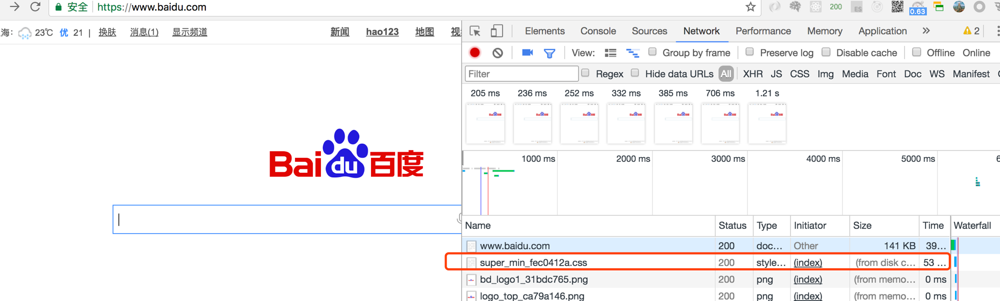
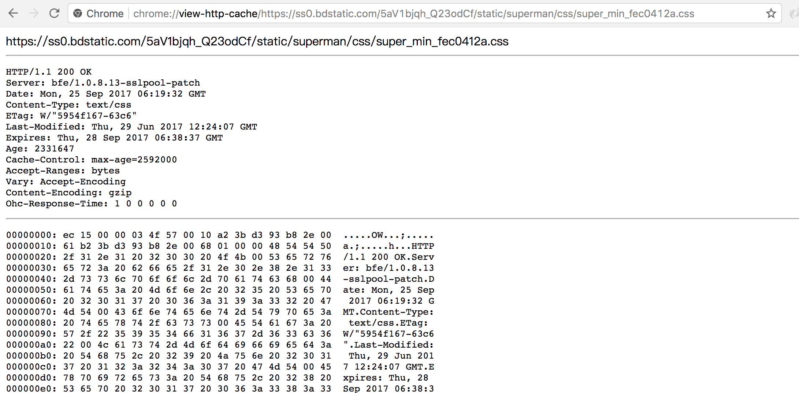
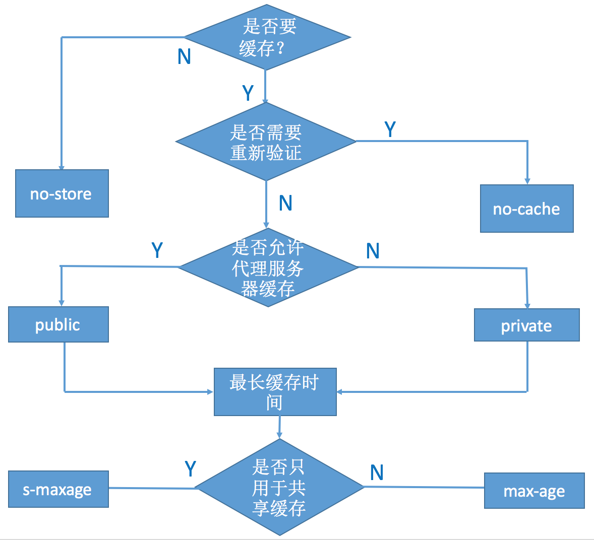
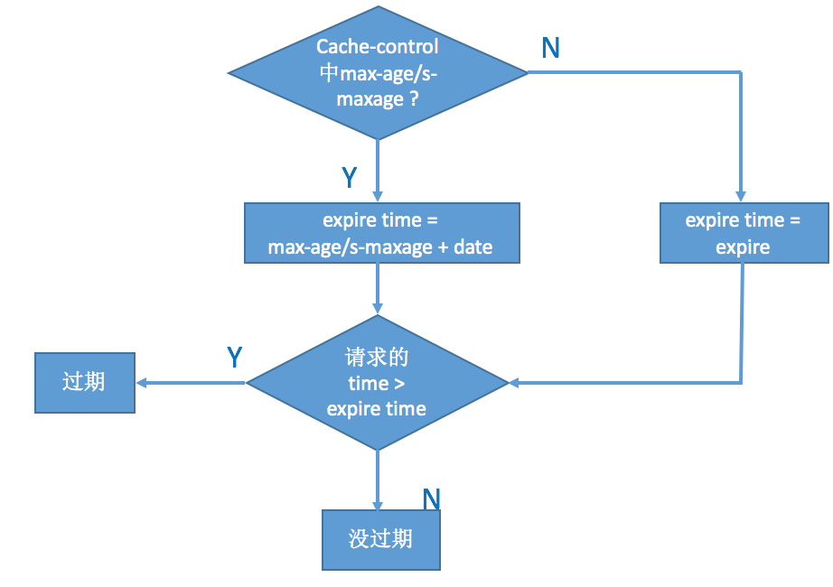
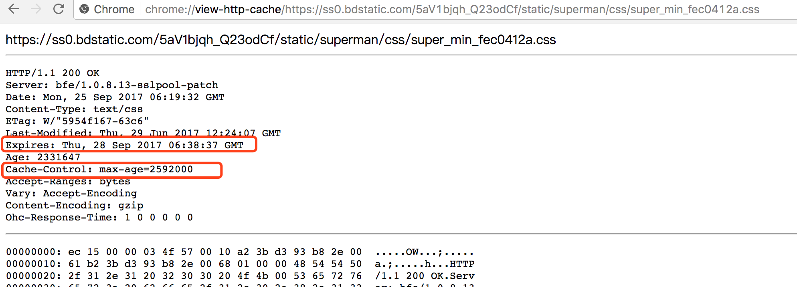
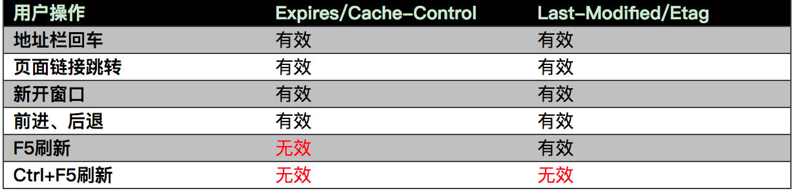

# [浏览器缓存机制](http://www.cnblogs.com/shixiaomiao1122/p/7591556.html)

#### 如何分析缓存（从何入手）
- 理解缓存原理
- 浏览器中查看缓存文件
- 缓存控制因素
- 分析网站缓存因素

#####1、 缓存原理
- 强缓存
  用户发送的请求，直接从客户端缓存中获取，不发送请求到服务器，不与服务器发生交互行为。
- 协商缓存
  用户发送的请求，发送到服务器后，由服务器判定是否从缓存中获取资源。
> 两者共同点：客户端获得的数据最后都是从客户端缓存中获得。
  两者的区别：从名字就可以看出，强缓存不与服务器交互，而协商缓存则需要与服务器交互。

#####2、 浏览器中查看缓存文件

  1）chrome中输入：[chrome://chrome-urls/](chrome://chrome-urls/)，查看 Chrome 功能列表。
  2）输入[chrome://cache](chrome://cache)，查看 Chrome 缓存文件

  
> 为了验证缓存，我们打开百度，打开开发者模式，去掉disable-cache选项

  从上图中可以看到，第一个从缓存中取的文件是： <https://ss0.bdstatic.com/5aV1bjqh_Q23odCf/static/superman/css/super_min_fec0412a.css>
  然后回到chrome://cache 页面，找到它，并点击进去，可以看到：
  
  回到问题，浏览器怎么判定是否有缓存，就可以转化为浏览器去读取本地放缓存的地方（注：不同浏览器不同系统都会不同）是否有该对应的请求啦。

#####3、 缓存控制因素

- Cache-Control
> Http1.1 中的标准，可以看成是 expires 的补充。使用的是相对时间的概念。
  Cache-Control的属性设置。

  1）max-age: 设置缓存的最大的有效时间，单位为秒（s）。max-age会覆盖掉Expires
  2) s-maxage: 只用于共享缓存，比如CDN缓存（s -> share）。与max-age 的区别是：max-age用于普通缓存，
  而s-maxage用于代理缓存。如果存在s-maxage,则会覆盖max-age 和 Expires.
  3) public：响应会被缓存，并且在多用户间共享。默认是public。
  4) private: 响应只作为私有的缓存，不能在用户间共享。如果要求HTTP认证，响应会自动设置为private。
  5）no-cache: 指定不缓存响应，表明资源不进行缓存。但是设置了no-cache之后并不代表浏览器不缓存，而是在缓存前要向服务器确认资源是否被更改。因此有的时候只设置no-cache防止缓存还是不够保险，还可以加上private指令，将过期时间设为过去的时间。
  6）no-store: 绝对禁止缓存。
  7）must-revalidate: 如果页面过期，则去服务器进行获取。
  设置cache-control 的规则可以参见下图：
  

所以判断缓存是否过期步骤是：
1） 查看是否有cache-control 的max-age / s-maxage , 如果有，则用服务器时间date值 + max-age/s-maxage 的秒数计算出新的过期时间，将当前时间与过期时间进行比较，判断是否过期
2）查看是否有cache-control 的max-age / s-maxage，则用expires 作为过期时间比较


#####4、 分析网站缓存因素

我们再以这张图为例，这张图中表明，客户端保留了一个服务器端的response header。
里面的Date字段表明此次缓存时服务器的时间。
里面有两个字段：expires 、Cache-Control

- expires
  Http1.0 中的标准，表明过期时间，注意此处的时间都是指的是服务器的时间。
  可以看到过期时间被设定为了：Thu, 28 Sep 2017 06:38:37 GMT

  存在的问题：服务器时间与客户端时间的不一致，就会导致缓存跟期待效果出现偏差。


> 总结：（b）过程执行完后，如果判定为未过期，则使用客户端缓存。那么就是属于“强缓存”。

## 四个过程详解


    先看上图，如果对图中的(a)(b)(c)(d)四个过程的处理方式都很清楚了，那么请不用再看本文了。

#### （c）跟服务器协商是否使用缓存


到这一步的时候，浏览器会向服务器发送请求，同时如果上一次的缓存中有Last-modified 和 Etag 字段，
浏览器将在request header 中加入If-Modified-Since（对应于Last-modified）， 和If-None-Match（对应于Etag）。

- Last-modified: 表明请求的资源上次的修改时间。

- If-Modified-Since：客户端保留的资源上次的修改时间。

- Etag：资源的内容标识。（不唯一，通常为文件的md5或者一段hash值，只要保证写入和验证时的方法一致即可）

- If-None-Match： 客户端保留的资源内容标识。

  1） 分布式系统尽量关闭Etag，因为每台机器生成的Etag都不一样。
  2）分布式系统里多台机器间文件的Last-Modified必须一致，以免负载均衡不同导致对比失败。

通常情况下，如果同时发送 If-None-Match 、If-Modified-Since字段，服务器只要比较etag 的内容即可，当然具体处理方式，看服务器的约定规则。

#### （d）协商缓存

在这个阶段，服务器一般会将Cache-control、expires 、last-modified、date、etag 等字段在response header 中返回，便于下次缓存。当然具体的场景，也是看服务器的约定规则设定。

### 缓存的不同来源

： 这个问题暂时没有找到非常满意的、清楚的回答。

#### from disk cache

从磁盘中获取缓存资源，等待下次访问时不需要重新下载资源，而直接从磁盘中获取。它的直接操作对象为CurlCacheManager。

#### from memory cache

从内存中获取资源，等待下次访问时不需要重新下载资源，而直接从内存中获取。Webkit早已支持memoryCache。
目前Webkit资源分成两类，一类是主资源，比如HTML页面，或者下载项，一类是派生资源，比如HTML页面中内嵌的图片或者脚本链接，分别对应代码中两个类：　　　　MainResourceLoader和SubresourceLoader。虽然Webkit支持memoryCache，但是也只是针对派生资源，它对应的类为CachedResource，用于保存原始数据（比如CSS，JS等），以及解码过的图片数据。

#### 区别

当退出进程时，内存中的数据会被清空，而磁盘的数据不会，所以，当下次再进入该进程时，该进程仍可以从diskCache中获得数据，而memoryCache则不行。

#### 相似

diskCache与memoryCache相似之处就是也只能存储一些派生类资源文件。它的存储形式为一个index.dat文件，记录存储数据的url，然后再分别存储该url的response信息和content内容。Response信息最大作用就是用于判断服务器上该url的content内容是否被修改。

### 用户行为

最后附上一张，用户行为影响浏览器的缓存行为。


### 总结

自此可以将本文开头的流程图理解清楚。

### 遗留问题

- CDN缓存？
- param: no-cache?
- 分布式系统 ？
- 负载均衡？
- 缓存资源的存储与读取，浏览器是以什么规则去区分memory cache ， 还是disk cache ?

## 参考文献

[Chrome浏览器的缓存文件位置](http://jingyan.baidu.com/article/f3e34a128e41acf5ea653554.html)
[浏览器缓存机制](http://www.cnblogs.com/skynet/archive/2012/11/28/2792503.html)
[浏览器缓存知识小结及应用](http://mp.weixin.qq.com/s/HRrYWnZIWgE_Hawr81CZTw)
[200 ok 几种状态](http://www.cnblogs.com/tangyuu/p/6396644.html)

### ETag

```
ETag提供了另外一种方式，用于检测浏览器缓存中的组件与原始服务器上的组件是否匹配。摘抄自书上的例子：

不带缓存的请求：

Request：
GET /i/yahoo/gif HTTP 1.1
Host: us.yimg.com

Response:
HTTP 1.1 200 OK
Last-Modified:Tue,12 Dec 200603:03:59 GMT
ETag:”10c24bc-4ab-457elc1f“

再次请求相同组件:

Request：
GET /i/yahoo/gif HTTP 1.1
Host: us.yimg.com
If-Modified-Since:Tue,12 Dec 200603:03:59 GMT
If-None-Match:”10c24bc-4ab-457elc1f“

Response:
HTTP 1.1 304 Not Midified

为什么要引入ETag?
ETag主要是为了解决Last-Modified无法解决的一些问题：
1. 一些文件也许会周期性的更改，但是他的内容并不改变(仅仅改变的修改时间)，这个时候我们并不希望客户端认为这个文件被修改了，而重新GET;
2. 某些文件修改非常频繁，比如在秒以下的时间内进行修改，(比方说1s内修改了N次)，If-Modified-Since能检查到的粒度是s级的，这种修改无法判断(或者说UNIX记录MTIME只能精确到秒);
3. 某些服务器不能精确的得到文件的最后修改时间。

ETag带来的问题
ETag的问题在于通常使用某些属性来构造它，有些属性对于特定的部署了网站的服务器来说是唯一的。当使用集群服务器的时候，浏览器从一台服务器上获取了原始组件，之后又向另外一台不同的服务器发起条件GET请求，ETag就会出现不匹配的状况。例如：使用inode-size-timestamp来生成ETag，文件系统使用inode存储文件类型、所有者、组和访问模式等信息，在多台服务器上，就算文件大小、权限、时间戳等都相同，inode也是不同的。

最佳实践

1. 如果使用Last-Modified不会出现任何问题，可以直接移除ETag，google的搜索首页则没有使用ETag。
2. 确定要使用ETag，在配置ETag的值的时候，移除可能影响到组件集群服务器验证的属性，例如使用size-timestamp来生成时间戳。
```

### Expires与Cache-control

```
Expires 有缺点，比如说，服务端和客户端的时间设置可能不同，这就会使缓存的失效可能并不能精确的按服务器的预期进行
Cache-Control 是 HTTP1.1 才有的，不适用与 HTTP1.0，
Expires 既适用于 HTTP1.0，也适用于 HTTP1.1
当客户端两种头都能解析的时候，会优先使用 Cache-Control
HTTP 1.0中出现了Connection: keep-alive，但是
HTTP/1.0中默认使用Connection: close。在HTTP/1.1中已经默认使用Connection: keep-alive。
connection: keep-alive http1.0 用于建立长连接；；请求不会断，那为了区分各个请求，header中添加了 Content-Length字段
```