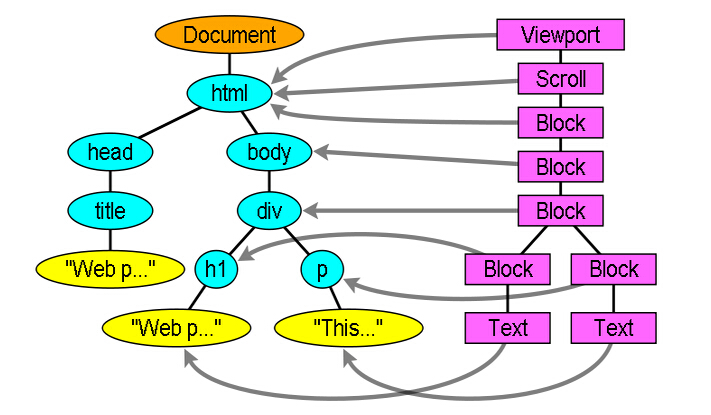

# [Web性能优化](https://segmentfault.com/a/1190000008693178)

### html 解析过程
```
由于浏览器采用至上而下的方式解析，所以会先解析html，直到遇到外部样式和外部脚本。这时会阻塞浏览器的解析，外部样式和外部脚本（在没有async、defer属性下）会并行加载，但是外部样式会阻塞外部脚本的执行。
```
### 重点
```
  即：html解析->外部样式、脚本加载->外部样式执行->外部脚本执行->html继续解析

  情况一：如果是动态脚本（即内联脚本）则不受样式影响，在解析到它时会执行。

  情况二：外部样式后续外部脚本含有async属性（IE下为defer），外部样式不会阻塞该脚本的加载与执行

  在外部样式执行完毕后，css附着于DOM，创建了一个渲染树（渲染树是一些被渲染对象的集）。每个渲染对象都

包含了与之对应的计算过样式的DOM对象，对于每个渲染元素来说，位置都经过计算，所以这里被叫做“布局”。然

后将“布局”显示在浏览器窗口，称之为“绘制”。

  接着脚本的执行完毕后，DOM树构建完成。这时，可以触发DOMContentLoaded事件。

  DOMContentLoaded事件的触发条件是：在所有的DOM全部加载完毕并且JS加载执行后触发。

 情况一：如果脚本是动态加载，则不会影响DOMContentLoaded时间的触发

 浏览器会等css加载完成后再加载图片，因为不确定图片的样式会如何。 

  要点一：CSS样式表会阻塞图片的加载，如果想让图片尽快加载，就不要给图片使用样式，比如宽高采用标签属性即可。

  要点二：脚本不会阻塞图片的加载

```
#### JS 和 CSS 的位置对其他资源加载顺序的影响
```
JS 和 CSS 在页面中的位置，会影响其他资源（指 img 等非 js 和 css 资源）的加载顺序，究其原因，有三个值得注意的点：

JS 有可能会修改 DOM.典型的，可能会有 document.write. 这意味着，在当前 JS 加载和执行完成前，后续所有资源的下载有可能是没必要的。这是 JS 阻塞后续资源下载的根本原因。
JS 的执行有可能依赖最新样式。比如，可能会有 var width = $('#id').width(). 这意味着，JS 代码在执行前，浏览器必须保证在此 JS 之前的所有 css（无论外链还是内嵌）都已下载和解析完成。这是 CSS 阻塞后续 JS 执行的根本原因。
现代浏览器很聪明，会进行 prefetch 优化。性能是如此重要，现代浏览器在竞争中，在 UI update 线程之外，还会开启另一个线程，对后续 JS 和 CSS 提前下载（注意，仅提前下载，并不执行）。有了 prefetch 优化，这意味着，在不存在任何阻塞的情况下，理论上 JS 和 CSS 的下载时机都非常优先，和位置无关。
以上三点可简述为三条基本定律：

定律一：资源是否下载依赖 JS 执行结果。
定律二：JS 执行依赖 CSS 最新渲染。
定律三：现代浏览器存在 prefetch 优化。
有了这三条定律，再来看克军的测试，就很清晰了：
```


# 1 Web性能优化

Web网站的性能细线在几个方面：

- 网站首页加载速度
- 动画的流畅度

通过分析浏览器的渲染原理、资源对渲染的影响，得出优化网站性能的办法。

# 2 查看性能的工具

Chrome的`Timeline`面板录制网页加载的过程，分析记录浏览器渲染过程中每个过程的耗时。

## 2.1 录制时注意事项

1. 禁用浏览器缓存：`Network Tab`下的`disable cache`
2. 关闭Chrome扩展或者启用隐身模式
3. 根据使用场景，模拟真实的网络加载情况：`Network Tab`下的`throttling`下拉按钮

## 2.2 `Timeline`工具的各个组成

- 在`Main Thread`中可以看到页面渲染的整个过程及耗时


# 3 浏览器渲染原理


## 3.1 DOM树构建

DOM树的构建过程

1. 根据HTML文档的内容，根据标签进行分词`Token`
2. 根据`Token`生产对应的节点`Node`
3. 将节点根据嵌套关系组合为一棵对象节点树`DOM`

> 浏览器解析文档对象模型`DOM`是**增量进行**的，无需等待整个HTML文档加载完毕，便可以开始解析`DOM`
>
> `CSSOM`解析会阻塞`HTML Parser`；JavaScript脚本文件**执行**会阻塞HTML解析；**CSS、JavaScript、Images和Font等静态资源的异步加载的，渲染页面与CSS解析与JavaScript执行会有相互的依赖**


## 3.2 CSSOM树的构建

`CSSOM`的解析依赖于**选择器**，选择器的匹配是从内到外的。所以选择器嵌套层次越深，匹配的时间会越长。

> `CSSOM`只解析可视部分`body`标签中的内容，将所有匹配的元素共同构建一个`CSSOM`树，**从根节点一次向下，所有节点的属性向下继承**


## 3.3 RenderTree树的构建

**利用DOM和CSSOM组合构建生成RenderTree**，对应`Recaculate Style`

> RenderTree中包含所有渲染网页必须的节点
>
> **无需渲染的节点不会被添加到RenderTree中，如head和display:none;的节点**
>
> `visibility: hidden;`的节点会添加到RenderTree中


## 3.4 Layout

`Layout`利用渲染树的信息，计算渲染树中所有节点在页面上的**位置和大小**。

> 类似绘画中各个元素位置摆放及尺寸规划

会引起页面重新Layout的操作：**所有改变节点位置和大小的操作**

- 屏幕旋转
- 浏览器视窗改变
- 与大小、位置相关的CSS属性
- 增加与删除DOM元素

> Layout操作比较耗时，对于动画中频繁引起Layout的操作（元素位置移动），**最好使用transform代替，可以使用GPU进行动画处理（将Layout重绘在GPU完成）**


### `viewport`

如果页面`body`元素设置的宽度为`100%`，并且根元素`html`没有明确设置宽度绝对值，**此时body元素的宽度等于viewport的宽度vw**

- 使用`meta`标签可以设置浏览器`viewport`的尺寸。`<meta name="viewport" content="width=device-width">`
- `device-width`为浏览器的理想视口（屏幕的物理分辨率）
- 在移动端，如果不设置`device-width`，默认`viewport`宽度为980px，**导致文字很小，需要放大**

> `viewport`相当于可视内容布局的容器

## 3.5 Paint

填充Layout中的具体内容和样式，将Layout生成的区域填充为最终显示在屏幕上的像素

## 3.6 总结

1. 浏览器通过`GET`请求获取网页HTML，同时将增量解析HTML文档，生成`DOM`树
2. 解析`DOM`节点树时，对于需要加载的资源**全部执行异步加载，但是CSS的解析、JavaScript的执行与font文件的下载会阻塞HTML Parser**
3. 局部`DOM`树与`CSSOM`树构建完成后，**立即组装RenderTree进行渲染**


# 4 资源对渲染的影响

页面中加载的资源主要包括：`css`、`js`脚本文件和`font`字体与`images`静态资源，不同资源类型对渲染的影响不同。

## 4.1 浏览器渲染页面的时机

增量解析解析`DOM`树，并且完成相应`CSSOM`解析后（RenderTree依赖于`DOM`树，`CSSOM`树），开始直接渲染页面。

## 4.2 CSS加载会阻塞初次渲染


## 4.3 非关键资源

对于首页无关的样式，需要使用适当的方式避免其阻塞初次渲染：

- `document.write()`会阻塞页面初次渲染
- 使用`media=print`媒体查询，虽然加载样式表，但只针对打印时才应用该样式，不会阻塞初次渲染。
- 通过`DOM`API引入CSS，可以避免阻塞。
- CSS中`<link rel="preload" href="index_print.css" as="style" onload="this.rel='stylesheet'">`。


## 4.4 JS文件


- 输出：先输出`Hello`，10s之后再输出`World`。JS脚本**执行**会阻塞`HTML Parser`，但是`HTML Parser`是增量解析的，**并且CSS样式的解析会阻塞JS脚本执行**，当解析完`Hello`时，生成对应`DOM`节点，并且完成其`CSSOM`，直接开始渲染`Hello`节点。
- 脚本执行完成后再解析后续的`World`

> JS脚本执行会阻塞HTML Parser；
>
> CSS解析会阻塞JS脚本执行：js可能会读、写CSSOM
>
> 虽然JS会阻塞HTML Parser解析；**但是浏览器的资源异步加载机制Preload会异步加载head标签内的资源**


## 4.5 非关键JS资源解析阻塞的优化方案

- 将JS资源文件放在文档底部，延迟JS的执行（但是存在必须解析完HTML才能加载JS资源，相较于`head`标签中加载会慢）
- 使用`defer`延迟脚本执行：`scipt`标签的`defer`属性，脚本会在HTML文档解析完毕后再开始执行；**被defer的脚本在执行时严格按照HTML文档中出现的顺序执行**---优势可以提早加载JS资源，但是解析完HTML再执行
- 使用`async`异步执行脚本：
  - 当`script`标签有`async`属性时，脚本执行不会阻塞HTML Parser，只要脚本加载完毕便开始执行
  - 被`async`的脚本，不会严格按照在HTML文档中的顺序执行
  - `async`适用于无依赖的外部独立资源（注意不要错误操作状态）


## 4.6 `font`字体文件

- `font`字体文件会阻塞内容渲染
  

## 4.7 图片资源

**图片资源的加载不会阻塞渲染，但是最好在HTML标签中设置图片的高度和宽度，可以在Layout时留出图片渲染的空间，避免页面的抖动**

# 5 优化关键渲染路径

**优化目标是将下列三个指标压缩到最低：**

- 关键资源数---初次渲染时依赖的资源
- 关键资源的体积最小---压缩文件或图片
- 关键资源网络来回数---网络传输资源消耗很多时间


# 6 其余优化过程

- HTTP2可以在传输HTML页面后向客户端推送页面内包含的资源
- 减少资源的大小：压缩
- 减少请求的来回时间




### DOM节点原生操作：增、删、改、查

增： `createElement、insertBefore/appendChild`

删： `removeChild`

改： `replaceChild`

查： 

```
document: getElementById | getElementByTagName | getElementByName
obj: 
parentNode 父节点(ie.parentElement)
offsetParent 所有父节点
childNodes: 孩子节点
firstChild 第一个孩子
lastChild 最后一个孩子
previousSibling 前一个兄弟节点
nextSibling 下一个兄弟节点
```

### 高性能 web
```
客户端：
  1、html，js, css 压缩
  2、使用 外部 js css
  3、CDN
  4、减少 HTTP 请求
  5、使用 Ajax 可缓存
  6、css 在上，js 在下
服务端：
  1、配置 ETag, Expires， GZip
  2、API 响应优化（数据库优化，SQL 优化，分区分库分表，读写分离，分布式）
```

懒加载有图片懒加载和路由懒加载
图片懒加载原理是使用js监听图片元素是否进入可视窗口，进入之前，将图片链接设为假地址而真正的地址用自定义属性储存起来，进入之后，将src属性值替换成真正地址； 
优点：能防止页面一次性向服务器响应大量请求导致服务器响应慢，页面卡顿或崩溃等问题； 
路由懒加载：把所有代码分成几块，按需加载；按照路由跳转加载需要的代码块，同样地减少不必要的服务器请求；

什么是按需加载
按需加载是前端性能优化中的一项重要措施，按需加载是如何定义的呢？顾名思义，指的是当用户触发了动作时才加载对应的功能。触发的动作，是要看具体的业务场景而言，包括但不限于以下几个情况：鼠标点击、输入文字、拉动滚动条，鼠标移动、窗口大小更改等。加载的文件，可以是JS、图片、CSS、HTML等。后面将会详细介绍“按需”的理解。

白屏原因
1-在弱网络下(2G网路或者GPRS网络) ,网络延迟，JS加载延迟 ,会阻塞页面

2-客户端存在bug，缓存模块错乱，不缓存js等后来挂起的文件，以及乱缓存index.html


#### 移动端白屏的解决与优化方案
 
很多无线端都使用前端模板进行数据渲染，在糟糕的网速情况下，一进去页面，看到的不是白屏就是 loading，这就是白屏问题。
 
此问题发生的原因基本可以归结为网速、静态资源。
 
1、css文件加载需要一些时间，在加载的过程中页面是空白的。
  解决：可以考虑将css代码前置和内联。
2、首屏无实际的数据内容，等待异步加载数据再渲染页面导致白屏。
  解决：在首屏直接同步渲染html，后续的滚屏等再采用异步请求数据和渲染html。
3、首屏内联js的执行会阻塞页面的渲染。
  解决：尽量不在首屏html代码中放置内联脚本。
 
还有一些其他的解决办法：
根本原因是客户端渲染的无力，因此最简单的方法是在服务器端，使用模板引擎渲染所有页面。同时
1、减少文件加载体积，如html压缩，js压缩
2、加快js执行速度 比如常见的无限滚动的页面，可以使用js先渲染一个屏幕范围内的东西
3、提供一些友好的交互，比如提供一些假的滚动条
4、使用本地存储处理静态文件。