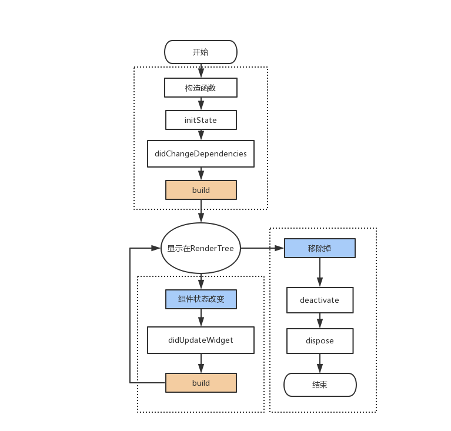

### install
- 重新安装 AS(不使用代理,disable.android.first.run=true)、Java、flutter(git clone -b beta)
- flutter 插件安装（AS 或 VS ）
- ~/.bash_profile 环境变量配置
- flutter doctor
- AS 中创建 VM , VS中开发

### class

- MaterialApp (title, routes, home)
- Scaffold (appBar, body, floatingActionButton,persistentFooterButtons, drawer,bottomNavigationBar)
- Widget
- StatelessWidget
- StatefulWidget

### 布局
```
x: Row
y: Column
z: Stack - web:absolute
```
- Flexible
- Expanded (继承自 Flexible,默认要占满分配的空间)

### 
- Text
- TextStyle
- RaisedButton

- launch(url) # 打开默认浏览器

### 
```
import 'package:flutter/rendering.dart' show debugPaintSizeEnabled;
debugPaintSizeEnabled = true;      //打开视觉调试开关
```

### [flutter 生命周期](https://www.jianshu.com/p/c3c9beacbb94)



### 请求拦截
- 统一拦截
- 统一设置
- 统一处理

### 组件通信
- 父子通信
- 兄弟通信
- 状态管理


### [手势识别器分类](https://www.jianshu.com/p/3b87ddb022af)
- Flutter中的GestureDetector一共有 7大类25种。
```
Tap：
onTapDown: (details) {},
onTapUp: (details) {},
onTap: () {},
onTapCancel: () {},

双击：
onDoubleTap: () {},

长按：
onLongPress: () {},
onLongPressUp: () {},

垂直滑动：
onVerticalDragDown: (details) {},
onVerticalDragStart: (details) {},
onVerticalDragUpdate: (details) {},
onVerticalDragEnd: (details) {},
onVerticalDragCancel: () {},

水平滑动：
onHorizontalDragDown: (details) {},
onHorizontalDragStart: (details) {},
onHorizontalDragUpdate: (details) {},
onHorizontalDragEnd: (details) {},
onHorizontalDragCancel: () {},

Pan事件：
指针已接触屏幕并可能开始移动。
onPanDown: (details) {},
指针已经接触屏幕并开始移动。
onPanStart: (details) {},
与屏幕接触并移动的指针再次移动。
onPanUpdate: (details) {}, 
先前与屏幕接触并移动的指针不再与屏幕接触，并且当它停止接触屏幕时以特定速度移动。
onPanEnd: (details) {},
先前触发 onPanDown 的指针未完成。
onPanCancel: () {},

Scale事件：
onScaleStart: (details) {},
onScaleUpdate: (details) {},
onScaleEnd: (details) {},

```

### [Material Design](https://material.io/tools/icons)


### [Flutter 中文网](https://book.flutterchina.club/)


### [Flutter 常用工具类库](https://www.jianshu.com/p/425a7ff9d66e)
[common_utils](https://github.com/Sky24n/common_utils)

1. TimelineUtil : 时间轴.(新)
1. TimerUtil    : 倒计时，定时任务.(新)
1. MoneyUtil    : 精确转换,防止精度丢失，分元互转，支持格式输出.(新)
1. LogUtil      : 简单封装打印日志.(新)
1. DateUtil     : 日期转换格式化输出.
1. RegexUtil    : 正则验证手机号，身份证，邮箱等等.
1. NumUtil      : 保留x位小数.精确加、减、乘、除, 防止精度丢失.
1. ObjectUtil  : 判断对象是否为空(String List Map),判断两个List是否相等.

[Flutter工具类库](https://github.com/Sky24n/flustars)

1. SpUtil : SharedPreferences 工具类.
1. ScreenUtil : 获取屏幕宽、高、密度，AppBar高，状态栏高度，屏幕方向.
1. WidgetUtil : Widget渲染监听，获取Widget宽高，在屏幕上的坐标.


### [search packages](https://pub.dartlang.org/)

> https://pub.dartlang.org/


### common command

```
flutter -h
fluter doctor
fluter doctor --android-licenses

flutter devices # 真机
flutter emulatprs # 模拟器
flutter emulatprs --launch [id] #启动某个模拟器
flutter create demo # 创建项目

flutter logs
flutter packages get

flutter run
flutter run --release

flutter build apk
flutter build ios --no-codesign

#发布之前，检查pubspec.yaml、README.md以及CHANGELOG.md文件内容的完整性和正确性
flutter packages pub publish --dry-run
flutter packages pub publish
```

### [Flutter常见问题FAQ](https://blog.csdn.net/zhangxiangliang2/article/details/75675693)