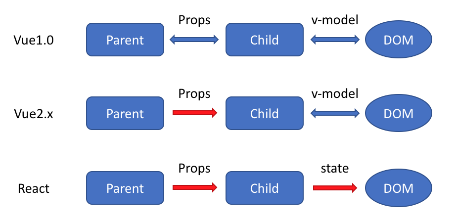
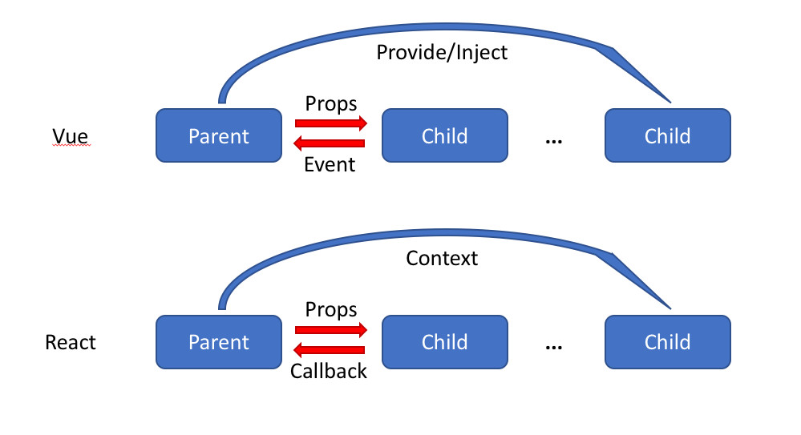

# 关于Vue和React区别的一些笔记


github.com/lihongxun945/myblog/issues/21

# 数据流的不同

[](https://raw.githubusercontent.com/lihongxun945/myblog/master/images/vue-vs-react-data-flow.png)

这篇文章记录我在使用Vue和React的时候，对他们的不同之处的一些思考，不仅局限于他们本身，也会包括比如 Vuex/Redux 等经常搭配使用的工具。因为涉及到的内容很多，可能下面的每一个点都能写成一篇文章，这次先简单做一个概要，等我有空做一个详细的专题出来。

**监听数据变化的实现原理不同**

Vue 通过 getter/setter 以及一些函数的劫持，能精确知道数据变化，不需要特别的优化就能达到很好的性能

React 默认是通过比较引用的方式进行的，如果不优化（PureComponent/shouldComponentUpdate）可能导致大量不必要的VDOM的重新渲染

为什么 React 不精确监听数据变化呢？这是因为 Vue 和 React 设计理念上的区别，Vue 使用的是可变数据，而React更强调数据的不可变。所以应该说没有好坏之分，Vue更加简单，而React构建大型应用的时候更加鲁棒。

因为一般都会用一个数据层的框架比如 Vuex 和 Redux，所以这部分不作过多解释，在最后的 vuex 和 redux的区别 中也会讲到。

**数据流的不同**




大家都知道Vue中默认是支持双向绑定的。在Vue1.0中我们可以实现两种双向绑定：

父子组件之间，props 可以双向绑定

组件与DOM之间可以通过 v-model 双向绑定

在 Vue2.x 中去掉了第一种，也就是父子组件之间不能双向绑定了（但是提供了一个语法糖自动帮你通过事件的方式修改），并且 Vue2.x 已经不鼓励组件对自己的 props 进行任何修改了。

所以现在我们只有 组件 <--> DOM 之间的双向绑定这一种。

然而 React 从诞生之初就不支持双向绑定，React一直提倡的是单向数据流，他称之为 onChange/setState()模式。

不过由于我们一般都会用 Vuex 以及 Redux 等单向数据流的状态管理框架，因此很多时候我们感受不到这一点的区别了。

**HoC 和 mixins**

在 Vue 中我们组合不同功能的方式是通过 mixin，而在React中我们通过 HoC (高阶组件）。

React 最早也是使用 mixins 的，不过后来他们觉得这种方式对组件侵入太强会导致很多问题，就弃用了 mixinx 转而使用 HoC，关于mixin究竟哪里不好，可以参考React官方的这篇文章 Mixins Considered Harmful

而 Vue 一直是使用 mixin 来实现的。

为什么 Vue 不采用 HoC 的方式来实现呢？

高阶组件本质就是高阶函数，React 的组件是一个纯粹的函数，所以高阶函数对React来说非常简单。

但是Vue就不行了，Vue中组件是一个被包装的函数，并不简单的就是我们定义组件的时候传入的对象或者函数。比如我们定义的模板怎么被编译的？比如声明的props怎么接收到的？这些都是vue创建组件实例的时候隐式干的事。由于vue默默帮我们做了这么多事，所以我们自己如果直接把组件的声明包装一下，返回一个高阶组件，那么这个被包装的组件就无法正常工作了。

推荐一篇很棒的文章讲的是vue中如何实现高阶组件 探索Vue高阶组件

**组件通信的区别**


其实这部分两个比较相似。

在Vue 中有三种方式可以实现组件通信：

父组件通过 props 向子组件传递数据或者回调，虽然可以传递回调，但是我们一般只传数据，而通过 事件的机制来处理子组件向父组件的通信

子组件通过 事件 向父组件发送消息

通过 V2.2.0 中新增的 provide/inject 来实现父组件向子组件注入数据，可以跨越多个层级。

另外有一些比如访问 $parent/$children等比较dirty的方式这里就不讲了。

在 React 中，也有对应的三种方式：

父组件通过 props 可以向子组件传递数据或者回调

可以通过 context 进行跨层级的通信，这其实和 provide/inject 起到的作用差不多。

可以看到，React 本身并不支持自定义事件，Vue中子组件向父组件传递消息有两种方式：事件和回调函数，而且Vue更倾向于使用事件。但是在 React 中我们都是使用回调函数的，这可能是他们二者最大的区别。

**模板渲染方式的不同**

在表层上， 模板的语法不同

React 是通过JSX渲染模板

而Vue是通过一种拓展的HTML语法进行渲染

但其实这只是表面现象，毕竟React并不必须依赖JSX。

在深层上，模板的原理不同，这才是他们的本质区别：

React是在组件JS代码中，通过原生JS实现模板中的常见语法，比如插值，条件，循环等，都是通过JS语法实现的

Vue是在和组件JS代码分离的单独的模板中，通过指令来实现的，比如条件语句就需要 v-if 来实现

对这一点，我个人比较喜欢React的做法，因为他更加纯粹更加原生，而Vue的做法显得有些独特，会把HTML弄得很乱。举个例子，说明React的好处：

react中render函数是支持闭包特性的，所以我们import的组件在render中可以直接调用。但是在Vue中，由于模板中使用的数据都必须挂在 this 上进行一次中转，所以我们import 一个组件完了之后，还需要在 components 中再声明下，这样显然是很奇怪但又不得不这样的做法。

**Vuex 和 Redux 的区别**

从表面上来说，store 注入和使用方式有一些区别。

在 Vuex 中，$store 被直接注入到了组件实例中，因此可以比较灵活的使用：

使用 dispatch 和 commit 提交更新

通过 mapState 或者直接通过 this.$store 来读取数据

在 Redux 中，我们每一个组件都需要显示的用 connect 把需要的 props 和 dispatch 连接起来。

另外 Vuex 更加灵活一些，组件中既可以 dispatch action 也可以 commit updates，而 Redux 中只能进行 dispatch，并不能直接调用 reducer 进行修改。

从实现原理上来说，最大的区别是两点：

Redux 使用的是不可变数据，而Vuex的数据是可变的。Redux每次都是用新的state替换旧的state，而Vuex是直接修改

Redux 在检测数据变化的时候，是通过 diff 的方式比较差异的，而Vuex其实和Vue的原理一样，是通过 getter/setter来比较的（如果看Vuex源码会知道，其实他内部直接创建一个Vue实例用来跟踪数据变化）

而这两点的区别，其实也是因为 React 和 Vue的设计理念上的区别。React更偏向于构建稳定大型的应用，非常的科班化。相比之下，Vue更偏向于简单迅速的解决问题，更灵活，不那么严格遵循条条框框。因此也会给人一种大型项目用React，小型项目用 Vue 的感觉。


# 传统diff、react优化diff、vue优化diff


## 传统diff

计算两颗树形结构差异并进行转换，传统diff算法是这样做的：循环递归每一个节点


传统diff.png

比如左侧树a节点依次进行如下对比，左侧树节点b、c、d、e亦是与右侧树每个节点对比
算法复杂度能达到O(n^2)，n代表节点的个数

> a->e、a->d、a->b、a->c、a->a

查找完差异后还需计算最小转换方式，这其中的原理我没仔细去看，最终达到的算法复杂度是O(n^3)

## react优化的diff策略

传统diff算法复杂度达到O(n^3 )这意味着1000个节点就要进行数10亿次的比较，这是非常消耗性能的。react大胆的将diff的复杂度从O(n^3)降到了O(n)，他是如何做到的呢

- 由于web UI中跨级移动操作非常少、可以忽略不计，所以react实现的diff是同层级比较

  

  

  react的diff.png

- 拥有相同类型的两个组件产生的DOM结构也是相似的，不同类型的两个组件产生的DOM结构则不近相同

- 对于同一层级的一组子节点，通过分配唯一唯一id进行区分（key值）

#### react虚拟节点

dom中没有直接提供api让我们获取一棵树结构，这里我们自己构建一个虚拟的dom结构，遍历这样的数据结构是一件很轻松直观的事情。
对于下面的dom，可以用js构造出一个简单的虚拟dom

```
<div className="myDiv">
  <p>1</p>
  <div>2</div>
  <span>3</span>
</div>
{
  type: 'div',
  props: {
      className: 'myDiv',
  },
  chidren: [
      {type: 'p',props:{value:'1'}},
      {type: 'div',props:{value:'2'}},
      {type: 'span',props:{value:'3'}}
  ]
}
```

#### 先序深度优先遍历

首先要遍历新旧两棵树，采用深度优先策略，为树的每个节点标示唯一一个id


先序深度优先遍历

在遍历过程中，对比新旧节点，将差异记录下来，记录差异的方式后面会提到

```
//若新旧树节点只是位置不同，移动
//计算差异
//插入新树中存在但旧树中不存在的节点
//删除新树中没有的节点

// diff 函数，对比两棵树
function diff (oldTree, newTree) {
  // 当前节点的标志，以后每遍历到一个节点，加1
  var index = 0
  var patches = {} // 用来记录每个节点差异的对象
  dfsWalk(oldTree, newTree, index, patches)
  return patches
}

// 对两棵树进行深度优先遍历
function dfsWalk (oldNode, newNode, index, patches) {
  // 对比oldNode和newNode的不同，记录下来
  patches[index] = [...]

  diffChildren(oldNode.children, newNode.children, index, patches)
}

// 遍历子节点
function diffChildren (oldChildren, newChildren, index, patches) {
  var leftNode = null
  var currentNodeIndex = index
  oldChildren.forEach(function (child, i) {
    var newChild = newChildren[i]
    currentNodeIndex = (leftNode && leftNode.count) // 计算节点的标识
      ? currentNodeIndex + leftNode.count + 1
      : currentNodeIndex + 1
    dfsWalk(child, newChild, currentNodeIndex, patches) // 深度遍历子节点
    leftNode = child
  })
}
```

#### 差异类型

上面代码中，将所有的差异保存在了`patches`对象中，会有如下几种差异类型：

1. 插入：`patches[0]:{type:'INSERT_MARKUP',node: newNode }`
2. 移动：`patches[0]: {type: 'MOVE_EXISTING'}`
3. 删除：`patches[0]: {type: 'REMOVE_NODE'}`
4. 文本内容改变：`patches[0]: {type: 'TEXT_CONTENT',content: 'virtual DOM2'}`
5. 属性改变：`patches[0]: {type: 'SET_MARKUP',props: {className:''}`}

#### 列表对比

节点两两进行对比时，我们知道新节点较旧节点有什么不同。如果同一层的多个子节点进行对比，他们只是顺序不同，按照上面的算法，会先删除旧节点，再新增一个相同的节点，这可不是我们想看到的结果
实际上，react在同级节点对比时，提供了更优的算法：


同级比较

> 首先对新集合的节点(nextChildren)进行in循环遍历，通过唯一的key(这里是变量name)可以取得新老集合中相同的节点，如果不存在，prevChildren即为undefined。如果存在相同节点，也即prevChild === nextChild，则进行移动操作，但在移动前需要将当前节点在老集合中的位置与 lastIndex 进行比较，见moveChild函数，如下图


moveChild

> if (child._mountIndex < lastIndex)，则进行节点移动操作，否则不执行该操作。这是一种顺序优化手段，lastIndex一直在更新，表示访问过的节点在老集合中最右的位置（即最大的位置），如果新集合中当前访问的节点比lastIndex大，说明当前访问节点在老集合中就比上一个节点位置靠后，则该节点不会影响其他节点的位置，因此不用添加到差异队列中，即不执行移动操作，只有当访问的节点比lastIndex小时，才需要进行移动操作。

所以下图中只需要移动A、C


移动

具体分析参照：

浅谈React中的diff

React源码之Diff算法


## Vue优化的diff策略

既然传统diff算法性能开销如此之大，Vue做了什么优化呢？

- 跟react一样，只进行同层级比较，忽略跨级操作

react以及Vue在diff时，都是在对比虚拟dom节点，下文提到的节点都指虚拟节点。Vue是怎样描述一个节点的呢？

#### Vue虚拟节点

```
// body下的 <div id="v" class="classA"><div> 对应的 oldVnode 就是

{
  el:  div  //对真实的节点的引用，本例中就是document.querySelector('#id.classA')
  tagName: 'DIV',   //节点的标签
  sel: 'div#v.classA'  //节点的选择器
  data: null,       // 一个存储节点属性的对象，对应节点的el[prop]属性，例如onclick , style
  children: [], //存储子节点的数组，每个子节点也是vnode结构
  text: null,    //如果是文本节点，对应文本节点的textContent，否则为null
}
```

#### patch

diff时调用patch函数，patch接收两个参数`vnode，oldVnode`，分别代表新旧节点。

```
function patch (oldVnode, vnode) {
    if (sameVnode(oldVnode, vnode)) {
        patchVnode(oldVnode, vnode)
    } else {
        const oEl = oldVnode.el
        let parentEle = api.parentNode(oEl)
        createEle(vnode)
        if (parentEle !== null) {
            api.insertBefore(parentEle, vnode.el, api.nextSibling(oEl))
            api.removeChild(parentEle, oldVnode.el)
            oldVnode = null
        }
    }
    return vnode
}
```

patch函数内第一个`if`判断`sameVnode(oldVnode, vnode)`就是判断这两个节点是否为同一类型节点，以下是它的实现：

```
function sameVnode(oldVnode, vnode){
  //两节点key值相同，并且sel属性值相同，即认为两节点属同一类型，可进行下一步比较
    return vnode.key === oldVnode.key && vnode.sel === oldVnode.sel
}
```

也就是说，即便同一个节点元素比如div，他的`className`不同，Vue就认为是两个不同类型的节点，执行删除旧节点、插入新节点操作。这与react diff实现是不同的，react对于同一个节点元素认为是同一类型节点，只更新其节点上的属性。

#### patchVnode

对于同类型节点调用`patchVnode(oldVnode, vnode)`进一步比较:

```
patchVnode (oldVnode, vnode) {
    const el = vnode.el = oldVnode.el  //让vnode.el引用到现在的真实dom，当el修改时，vnode.el会同步变化。
    let i, oldCh = oldVnode.children, ch = vnode.children
    if (oldVnode === vnode) return  //新旧节点引用一致，认为没有变化
    //文本节点的比较
    if (oldVnode.text !== null && vnode.text !== null && oldVnode.text !== vnode.text) {
        api.setTextContent(el, vnode.text)
    }else {
        updateEle(el, vnode, oldVnode)
        //对于拥有子节点(两者的子节点不同)的两个节点，调用updateChildren
        if (oldCh && ch && oldCh !== ch) {
            updateChildren(el, oldCh, ch)
        }else if (ch){  //只有新节点有子节点，添加新的子节点
            createEle(vnode) //create el's children dom
        }else if (oldCh){  //只有旧节点内存在子节点，执行删除子节点操作
            api.removeChildren(el)
        }
    }
}
```

#### updateChildren

`patchVnode`中有一个重要的概念updateChildren，这是Vue diff实现的**核心**：

```
updateChildren (parentElm, oldCh, newCh) {
    let oldStartIdx = 0, newStartIdx = 0
    let oldEndIdx = oldCh.length - 1
    let oldStartVnode = oldCh[0]
    let oldEndVnode = oldCh[oldEndIdx]
    let newEndIdx = newCh.length - 1
    let newStartVnode = newCh[0]
    let newEndVnode = newCh[newEndIdx]
    let oldKeyToIdx
    let idxInOld
    let elmToMove
    let before
    while (oldStartIdx <= oldEndIdx && newStartIdx <= newEndIdx) {
            if (oldStartVnode == null) {   //对于vnode.key的比较，会把oldVnode = null
                oldStartVnode = oldCh[++oldStartIdx] 
            }else if (oldEndVnode == null) {
                oldEndVnode = oldCh[--oldEndIdx]
            }else if (newStartVnode == null) {
                newStartVnode = newCh[++newStartIdx]
            }else if (newEndVnode == null) {
                newEndVnode = newCh[--newEndIdx]
            }else if (sameVnode(oldStartVnode, newStartVnode)) {
                patchVnode(oldStartVnode, newStartVnode)
                oldStartVnode = oldCh[++oldStartIdx]
                newStartVnode = newCh[++newStartIdx]
            }else if (sameVnode(oldEndVnode, newEndVnode)) {
                patchVnode(oldEndVnode, newEndVnode)
                oldEndVnode = oldCh[--oldEndIdx]
                newEndVnode = newCh[--newEndIdx]
            }else if (sameVnode(oldStartVnode, newEndVnode)) {
                patchVnode(oldStartVnode, newEndVnode)
                api.insertBefore(parentElm, oldStartVnode.el, api.nextSibling(oldEndVnode.el))
                oldStartVnode = oldCh[++oldStartIdx]
                newEndVnode = newCh[--newEndIdx]
            }else if (sameVnode(oldEndVnode, newStartVnode)) {
                patchVnode(oldEndVnode, newStartVnode)
                api.insertBefore(parentElm, oldEndVnode.el, oldStartVnode.el)
                oldEndVnode = oldCh[--oldEndIdx]
                newStartVnode = newCh[++newStartIdx]
            }else {
               // 使用key时的比较
                if (oldKeyToIdx === undefined) {
                    oldKeyToIdx = createKeyToOldIdx(oldCh, oldStartIdx, oldEndIdx) // 有key生成index表
                }
                idxInOld = oldKeyToIdx[newStartVnode.key]
                if (!idxInOld) {
                    api.insertBefore(parentElm, createEle(newStartVnode).el, oldStartVnode.el)
                    newStartVnode = newCh[++newStartIdx]
                }
                else {
                    elmToMove = oldCh[idxInOld]
                    if (elmToMove.sel !== newStartVnode.sel) {
                        api.insertBefore(parentElm, createEle(newStartVnode).el, oldStartVnode.el)
                    }else {
                        patchVnode(elmToMove, newStartVnode)
                        oldCh[idxInOld] = null
                        api.insertBefore(parentElm, elmToMove.el, oldStartVnode.el)
                    }
                    newStartVnode = newCh[++newStartIdx]
                }
            }
        }
        if (oldStartIdx > oldEndIdx) {
            before = newCh[newEndIdx + 1] == null ? null : newCh[newEndIdx + 1].el
            addVnodes(parentElm, before, newCh, newStartIdx, newEndIdx)
        }else if (newStartIdx > newEndIdx) {
            removeVnodes(parentElm, oldCh, oldStartIdx, oldEndIdx)
        }
}
```

代码很长，解读参照文章下面提到的大神文章。原理示意图如下：


image.png

> 过程可以概括为：oldCh和newCh各有两个头尾的变量StartIdx和EndIdx，它们的2个变量相互比较，一共有4种比较方式。如果4种比较都没匹配，如果设置了key，就会用key进行比较，在比较的过程中，变量会往中间靠，一旦StartIdx>EndIdx表明oldCh和newCh至少有一个已经遍历完了，就会结束比较。

这种由两端至中间的对比方法与react的`updateChildren`实现也是不同，后者是从左至右依次进行对比，各有优点。
比如一个集合，只是把最后一个节点移到了第一个，react实现就出现了短板，react会依次移动前三个节点到对应的位置：


image.png

而Vue会在首尾对比时，只移动最后一个节点到第一位即可


详细解析有大神已经写了：[解析vue2.0的diff算法](https://segmentfault.com/a/1190000008782928)