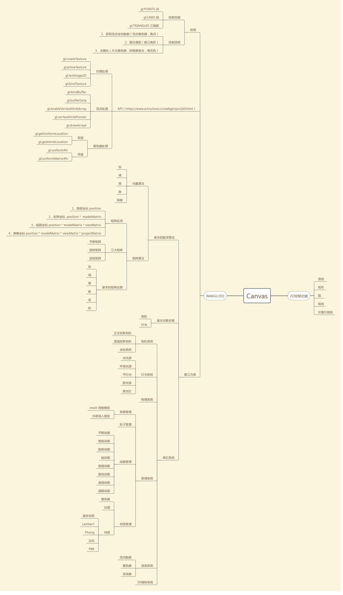
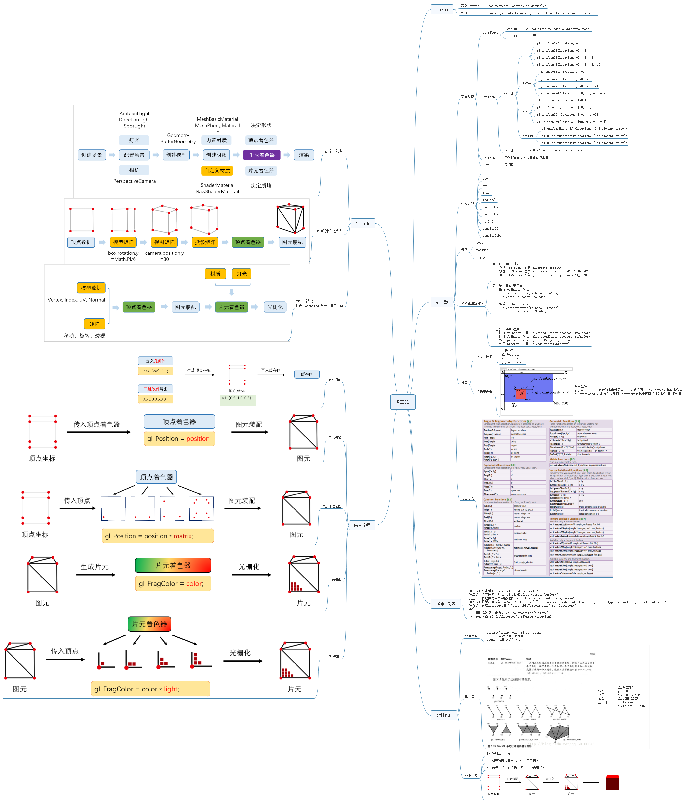
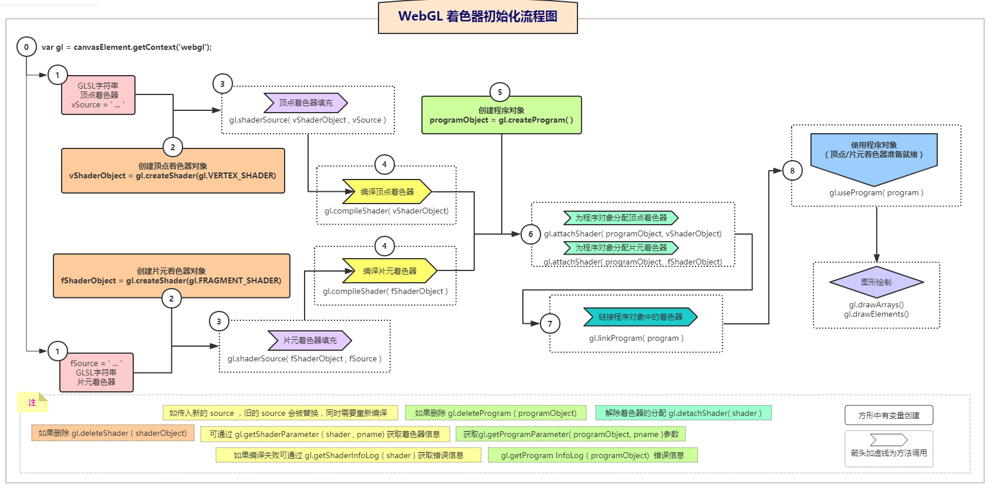

# [WEBGL](https://www.processon.com/mindmap/5ab4b29ae4b027675e366fd4)

[WebGL 运行流程](https://www.cnblogs.com/wanbo/p/6754066.html)

图元装配阶段，顶点着色器输出会依次经历：裁剪，透视分割，视口变换，才会到光栅化阶段。

图元装配，即将顶点根据primitive(原始的连接关系）还原成网格结构。网格由顶点和索引组成，在之前流水线中是对顶点的处理，在这个阶段是根据索引将顶点连接在一起，组成线、面单元。之后就是对超出屏幕外的三角形进行裁剪。

想象一下：一个三角形其中一个顶点在画面外，另外两个顶点在画面内，这时我们在屏幕上看到的就是一个四边形，然后将四边形切成两个三角形。

此外还有一个操作涉及到三角形的顶点顺序（其实也就是三角形的法向量朝向），根据右手定则来决定三角面片的法向量，如果该法向量朝向视点（法向量与到视点的方向的点积为正），该面是正面。

一般顶点按照逆时针排序。如果该面是反面，则进行背面去除操作。

所有的裁剪剔除计算都是为了减少需要绘制的顶点个数。

裁减是一个较大的概念，为了减少需要绘制的顶点个数，而识别指定区域内或区域外的图形部分的算法都称为裁减。

裁减算法主要包括：视域剔除、背面剔除、遮挡剔除和视口裁减等。

